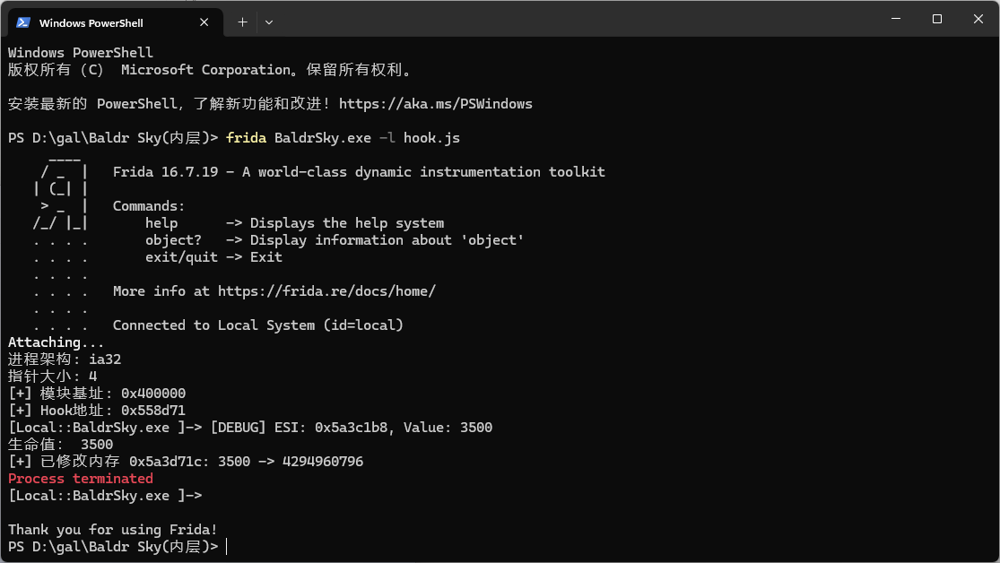

# Jbsd使用教程

> [!NOTE]
> 本插件需要电脑中带有Python3环境
> 
> Python3环境的安装请自行搜索
>
> 推荐使用Python虚拟环境

## 环境搭建

使用资源管理器进入**BaldrSky.exe**文件所在的目录

鼠标右键选择**在终端中打开**

接着输入下列命令（请忽略'>'这个符号）

```
> pip install frida-tools==13.0.0
> frida --version
```

无报错且显示frida版本为16.7.19 则环境准备完毕

## 本插件使用方法

在Github本仓库主页面下

点击**绿色按钮Code** 选择**Download ZIP**下载压缩包

解压压缩包后把**hook.js**文件复制到**BaldrSky.exe**文件所在的目录下

1. 鼠标双击启动BaldrSky.exe

2. 鼠标右键选择**在终端中打开** 接着输入下列命令

```
> frida BaldrSky.exe -l hook.js
```

若启动成功 则应显示如下图所示（显示到`[Local::BaldrSky.exe ]->`这一行）



## ⚠️注意事项（同博客注意事项）

1. Jbsd仅使用血量是否为1000判断是否是主角机体 只有当血量为1000才有无敌 否则会造成大量伤害 因此请关闭**机能扩张**中所有增加血量的插件 同时如果碰到敌方机体血量也为1000时请关闭Jbsd（情况比较少数，例：记忆溯行中基本所有的机体）
2. 由于第1点的限制 所有友方机体血量都不为1000 若是碰到与友方机体共同战斗的场景 尽量尽快解决战斗 不然**友方机体很可能也被敌方机体秒杀**（实测使用轻机枪基本所有场景都可以保护住友方机体）
3. 根据第2点 在战斗中可能会出现三种情况
    - 队友战死 战斗失败 可选择Retry
    - 队友战死 但是战斗正常结算 点击Close后闪退（这时重开插件和游戏即可）
    - 队友战死 战斗正常结算 点击Close后继续剧情（这一般是死掉的队友不是主要人物 因此无伤大雅 或者在此处没有检测队友是死是活）
4. 本插件并**未实现无限热量**的功能 因此最好使用轻机枪等射速快耗热量少的武器 在某些情况下保护队友可能比较困难 建议修改难度为VeryEasy后再次战斗
5. 仅发布在Github上 插件的使用请遵照Github的README